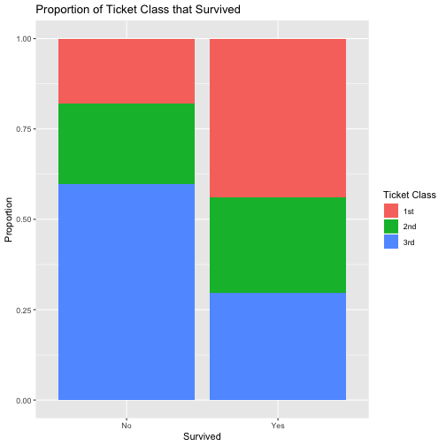
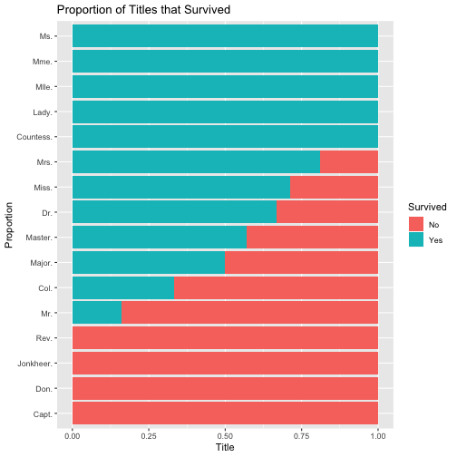

Predicting Titanic Survival
========================================================
author: Matthew Edwards
date: 23rd January 2020
autosize: true

<small> 
Data Scientist   
National Innovation Centre for Data   
</small>


Import - Check Data
========================================================


```r
data_path <- here("data", "titanic.csv")
read_lines(data_path, n_max = 4)
```

```
[1] "pclass,survived,name,sex,age,sibsp,parch,ticket,fare,cabin,embarked"                     
[2] "1.0,1.0,\"Allen, Miss. Elisabeth Walton\",female,29.0,0.0,0.0,24160.0,211.3375,B5,S"     
[3] "1.0,1.0,\"Allison, Master. Hudson Trevor\",male,0.9167,1.0,2.0,113781.0,151.55,C22 C26,S"
[4] "1.0,0.0,\"Allison, Miss. Helen Loraine\",female,2.0,1.0,2.0,113781.0,151.55,C22 C26,S"   
```

Import - Read Data
========================================================


```r
column_names <- c(
  "ticket_class",
  "survived",
  "name",
  "gender",
  "age",
  "sibling_spouse",
  "parent_child",
  "ticket_number",
  "ticket_fare",
  "cabin_number",
  "port_embarked"
)
```


```r
column_types <- cols(
  ticket_class = col_double(),
  survived = col_double(),
  name = col_character(),
  gender = col_character(),
  age = col_double(),
  sibling_spouse = col_double(),
  parent_child = col_double(),
  ticket_number = col_character(),
  ticket_fare = col_double(),
  cabin_number = col_character(),
  port_embarked = col_character()
)
```


```r
titanic <- read_csv(data_path,
  col_names = column_names,
  col_types = column_types,
  na = c("", "NA"),
  skip = 1
)
```

Import - Write Data
========================================================


```r
write_rds(titanic, path = here("data", "titanic_raw.rds"))
```

Tidy - Read Data
========================================================


```r
titanic <- read_rds(here("data", "titanic_raw.rds"))
```

Tidy - Format Features
========================================================


```r
titanic <- titanic %>%
  mutate(
    ticket_class = factor(ticket_class, labels = c("1st", "2nd", "3rd")),
    survived = factor(survived, labels = c("No", "Yes")),
    gender = factor(gender, labels = c("Female", "Male")),
    port_embarked = factor(port_embarked, labels = c("Cherbourg", "Queenstown", "Southampton"))
  )
```

Tidy - Generate Features
========================================================


```r
features <- c(
  "ticket_class",
  "survived",
  "title",
  "gender",
  "age",
  "family_size",
  "ticket_fare",
  "deck",
  "port_embarked"
)
```


```r
titanic_tidy <- titanic %>%
  mutate(
    title = factor(str_extract(name, pattern = "[:alpha:]*\\.")),
    deck = fct_explicit_na(factor(str_extract(cabin_number, pattern = "[:upper:]"))),
    family_size = sibling_spouse + parent_child,
    port_embarked = fct_explicit_na(port_embarked)
  ) %>%
  select(features) %>% 
  drop_na()
```

Tidy - Split Data
========================================================


```r
split <- initial_split(titanic_tidy, prop = 4 / 5, strata = "survived")
titanic_train <- training(split)
titanic_test <- testing(split)
```

Tidy - Write Data
========================================================


```r
write_rds(titanic_train, path = here("data", "titanic_train.rds"))
write_rds(titanic_test, path = here("data", "titanic_test.rds"))
```

Explore - Read Training Data
========================================================


```r
titanic <- read_rds(here("data", "titanic_train.rds"))
```

Explore - Numerical Statistics
========================================================


```r
skim(titanic)
```


|                         |        |
|:------------------------|:-------|
|Name                     |titanic |
|Number of rows           |837     |
|Number of columns        |9       |
|_______________________  |        |
|Column type frequency:   |        |
|factor                   |6       |
|numeric                  |3       |
|________________________ |        |
|Group variables          |None    |


**Variable type: factor**

|skim_variable | n_missing| complete_rate|ordered | n_unique|top_counts                            |
|:-------------|---------:|-------------:|:-------|--------:|:-------------------------------------|
|ticket_class  |         0|             1|FALSE   |        3|3rd: 397, 1st: 239, 2nd: 201          |
|survived      |         0|             1|FALSE   |        2|No: 495, Yes: 342                     |
|title         |         0|             1|FALSE   |       16|Mr.: 462, Mis: 170, Mrs: 137, Mas: 42 |
|gender        |         0|             1|FALSE   |        2|Mal: 523, Fem: 314                    |
|deck          |         0|             1|FALSE   |        9|(Mi: 610, C: 75, B: 56, D: 32         |
|port_embarked |         0|             1|FALSE   |        4|Sou: 633, Che: 166, Que: 36, (Mi: 2   |


**Variable type: numeric**

|skim_variable | n_missing| complete_rate|  mean|    sd|   p0|   p25|  p50| p75|   p100|hist  |
|:-------------|---------:|-------------:|-----:|-----:|----:|-----:|----:|---:|------:|:-----|
|age           |         0|             1| 29.98| 14.50| 0.17| 21.00| 28.0|  39|  80.00|▂▇▅▂▁ |
|family_size   |         0|             1|  0.92|  1.41| 0.00|  0.00|  0.0|   1|   7.00|▇▂▁▁▁ |
|ticket_fare   |         0|             1| 38.08| 56.38| 0.00|  8.05| 16.1|  39| 512.33|▇▁▁▁▁ |

Explore - Graphical Statistics
========================================================


```r
ggplot(data = titanic) +
  geom_bar(aes(x = survived, fill = ticket_class), position = "fill") +
  labs(title = "Proportion of Ticket Class that Survived",
       fill = "Ticket Class",
       x = "Survived",
       y = "Proportion")
```



Explore - Graphical Statistics
========================================================


```r
ggplot(data = titanic) +
  geom_bar(aes(x = fct_reorder(title, survived, function(x) mean(as.numeric(x))), fill = survived),
    position = "fill"
  ) +
  coord_flip() +
  labs(title = "Proportion of Titles that Survived",
       fill = "Survived",
       x = "Proportion",
       y = "Title")
```



Model - Read Data
========================================================


```r
titanic_train <- read_rds(here("data", "titanic_train.rds"))
titanic_test <- read_rds(here("data", "titanic_test.rds"))
```

Model - Preprocess Data
========================================================


```r
rec <- titanic_train %>%
  recipe(survived ~ .) %>%
  step_other(title, deck) %>% 
  step_dummy(all_nominal(), -all_outcomes()) %>% 
  prep(training = titanic_train)

titanic_train <- bake(rec, new_data = titanic_train)
titanic_test <- bake(rec, new_data = titanic_test)
```

Model - Specification
========================================================


```r
model <- rand_forest(
  mode = "classification",
  mtry = tune(),
  trees = tune(),
  min_n = tune()
) %>%
  set_engine("ranger")
```

Model - Cross-validation
========================================================


```r
folds <- vfold_cv(titanic_train, repeats = 5, strata = "survived")
```

Model - Candidate hyper-parameters
========================================================


```r
candidates <- parameters(
  mtry(c(1, 5)),
  trees(c(500, 1000)),
  min_n(c(1, 5))
) %>% 
  grid_max_entropy(size = 3)
```

Model - Hyper-parameter tuning
========================================================


```r
fit <- tune_grid(survived ~ .,
  model = model,
  rs = folds,
  grid = candidates,
  perf = metric_set(f_meas)
)

estimate(fit) %>% 
  filter(.metric == "f_meas") %>% 
  arrange(desc(mean)) %>% 
  slice(seq_len(5))
```

```
# A tibble: 3 x 8
   mtry trees min_n .metric .estimator  mean     n std_err
  <int> <int> <int> <chr>   <chr>      <dbl> <int>   <dbl>
1     5   547     3 f_meas  binary     0.933    50 0.00274
2     4   939     3 f_meas  binary     0.918    50 0.00309
3     3   516     1 f_meas  binary     0.906    50 0.00297
```

Model - Fitting
========================================================


```r
model <- rand_forest(
  mode = "classification",
  mtry = 5,
  trees = 645,
  min_n = 2
) %>%
  set_engine("ranger") %>% 
  fit(survived ~ ., data = titanic_train)
```

Model - Testing
========================================================


```r
predict(model, new_data = titanic_test) %>%
  bind_cols(titanic_test) %>%
  metric_set(accuracy, f_meas)(truth = survived, estimate = .pred_class)
```

```
# A tibble: 2 x 3
  .metric  .estimator .estimate
  <chr>    <chr>          <dbl>
1 accuracy binary         0.822
2 f_meas   binary         0.857
```
